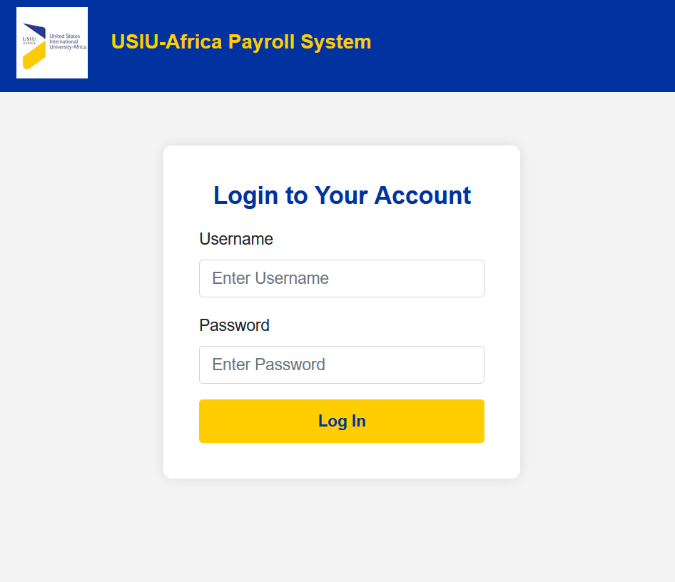
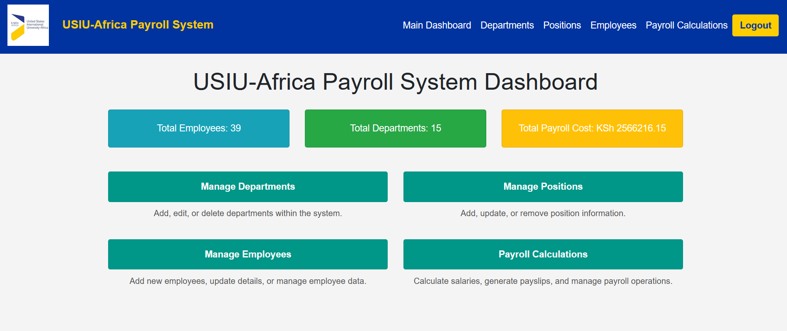
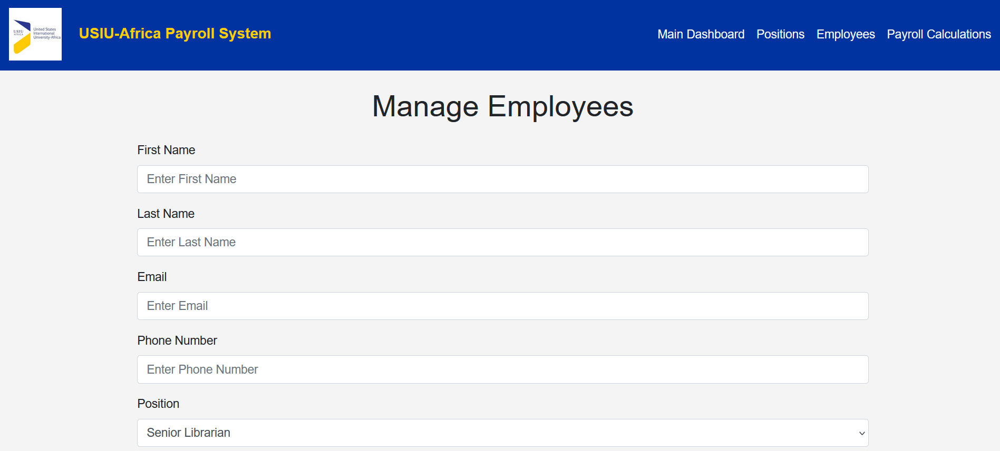
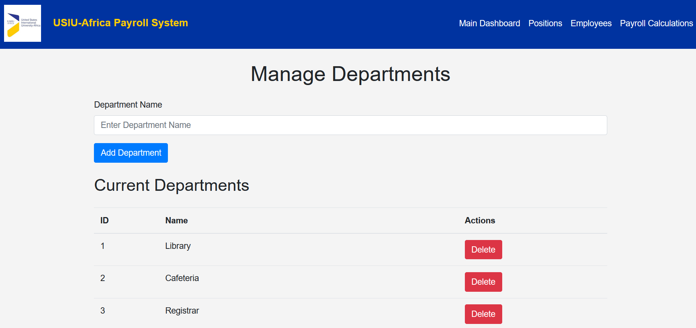
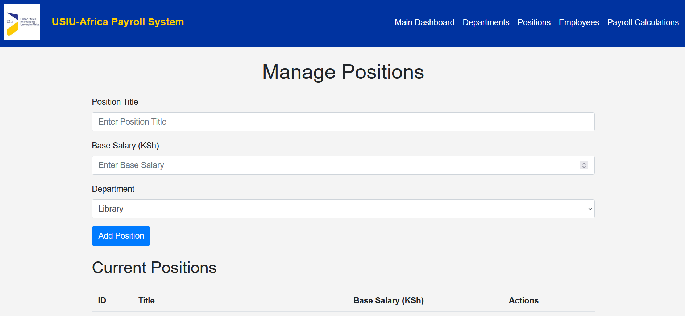
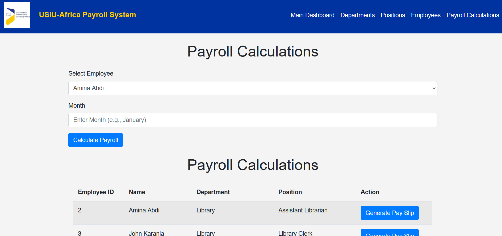
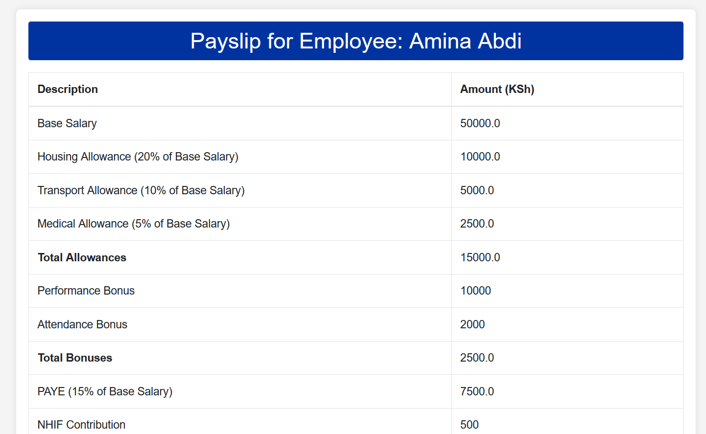

# **USIU-Africa Payroll System**

The USIU-Africa Payroll System is a web-based application designed to simplify and streamline payroll management for a hypothetical university in Kenya.

The system automates payroll processes, including salary computations, statutory deductions, and payslip generation, while ensuring compliance with Kenyan regulations.

## **Features**

- **Employee management**: Manage employee profiles with details such as name, department, job role, salary structure, and tax information.
- **Payroll calculation**: Automatically calculate salaries based on predefined structures, including allowances, bonuses, and statutory deductions like NHIF and NSSF contributions.
- **Tax computation**: Accurately compute PAYE deductions based on Kenyan tax brackets.
- **Payslip generation**: Generate digital payslips with detailed salary breakdowns, deductions, and net pay.
- **Role-based access control**: Secure data with role-specific permissions for administrators, HR personnel, finance staff, and employees.

## **Screenshots**

### **Login Page**


### **Dashboard**


### **Manage Employees**


### **Manage Departments**


### **Manage Positions**


### **Payroll Calculation**


### **Payslip**


## **Technologies Used**

- **Java**: Handles business logic, payroll calculations, and backend services.
- **Spring Boot**: Provides the framework for dependency injection and web application setup.
- **Thymeleaf Templates**: Enables dynamic content rendering and seamless integration with backend services.
- **Bootstrap**: Ensures a responsive and user-friendly interface.
- **MySQL**: Primary database for storing employee records, payroll data, and tax information.

## **Setup Instructions**

### **Prerequisites**

1. **Java Development Kit (JDK 21 or higher)**: Ensure Java is installed and set up on your system.
2. **MySQL Server**: Set up the database to store payroll and employee information. I used MySQL Workbench.
3. **Apache Maven**: For managing dependencies and building the application.

### **Steps to Set Up**

1. **Clone the Repository**
   ```bash
   git clone https://github.com/lizardcat/usiu-payroll-system.git
   cd usiu-payroll-system
   ```
2. **Set Up the Database**
   - Create a MySQL database and configure the connection details in `application.properties`:
     ```properties
     spring.datasource.url=jdbc:mysql://localhost:3306/usiu_payroll
     spring.datasource.username=admin
     spring.datasource.password=admin
     ```
3. **Install Dependencies**
   ```bash
   mvn install
   ```
4. **Run the Application**
   ```bash
   mvn spring-boot:run
   ```
5. **Access the Application**
   Open your browser and navigate to:
   ```
   http://localhost:8080
   ```

## **Future Enhancements**

- Implement additional reporting features for payroll analytics.
- Add support for exporting payroll data to Excel or PDF formats.
- Introduce two-factor authentication for added security.
- Expand tax computation to accommodate changes in Kenyan regulatory requirements.
